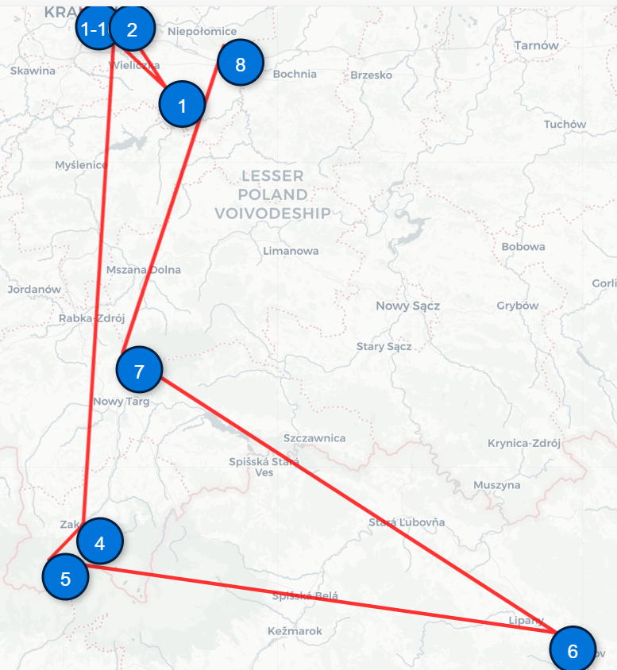

### LLM-based Trip Planner

This project is an automated **LLM-based travel planner** that generates a multi-day road trip tailored to your preferences. It uses a language model (via Ollama) to plan locations, validates and fixes coordinates, and renders an interactive map using Folium.

---

#### Features

- 🔮 Generates trip plans using a local LLM (via Ollama)
- 📍 Validates location coordinates with geopy and fallback LLM
- 🧹 Filters out geographic outliers and invalid entries
- 🗺️ Produces interactive maps with clustered markers and routes
- 🧠 Optional LangChain Agent to refine ambiguous results

---

#### Project Structure

```bash
trip_planner/
├── trip_planner.py                 # Main entry point
├── config.py                       # Loads environment variables
├── extract_coordinates.py          # Parses and sanitizes LLM outputs
├── prompt_trip.py                  # Trip planning prompts and LLM calls
├── remove_problemtaic_coords.py    # Outlier filtering logic
├── map.py                          # Folium map generation
├── agent_trip.py                   # Optional LangChain agent tools
├── output/                         # Generated maps and location CSVs
└── .env                            # User-defined trip config
```

---

#### Requirements

- Python 3.8+
- [Ollama](https://ollama.com/) installed and running locally
- One of the supported LLMs downloaded (e.g., `llama3`)
- Required Python packages:

```bash
pip install -r requirements.txt
```

Example `requirements.txt`:
```txt
langchain
langchain-community
langchain-ollama
folium
geopy
pandas
python-dotenv
```

---

#### Setup

1. **Install Ollama**

   See: https://ollama.com

2. **Download your preferred model** (e.g. LLaMA 3):
```bash
ollama pull llama3
```

3. **Create a `.env` file** with the trip parameters:

```env
MODEL_NAME=llama3
OLLAMA_HOST=http://localhost:11434

COUNTRY=Bulgaria
CITY_START=Sofia
CITY_END=Varna
DURATION=10
MONTH=July
COMPOSITION=a family with young children
```

---

#### Run the Planner

```bash
python trip_planner.py
```

This will:
- Generate a trip plan for the given settings
- Fix any coordinate or geolocation issues
- Save the map to: `output/trip_map_0.html`, `output/locations0.csv`, etc.

---

#### Optional: Use Agent for Validation

You can enable a LangChain agent that uses tools like:
- `geopy_lookup`: for real coordinate lookups
- `llm_coord_fallback`: for LLM-based correction
- `rerun_single_day`: re-generates problematic days

Uncomment this in `main()` to use:
```python
# locations_w_agent = try_agent(locations, llm_model)
```

---

#### Example Output



- **Blue markers** = trip days
- **Red line** = driving route
- Output CSV includes lat/lon and names per day

---

## 🧠 Roadmap Ideas

- Integrate LangGraph for retry/reasoning flow
- Support hotels, distances, or live traffic APIs
- Export to mobile formats (e.g., GPX, Google Maps)

---

## 🧑‍💻 Author

Built with ❤️ by [Your Name]  
Feel free to fork and adapt it to your region or use case!
